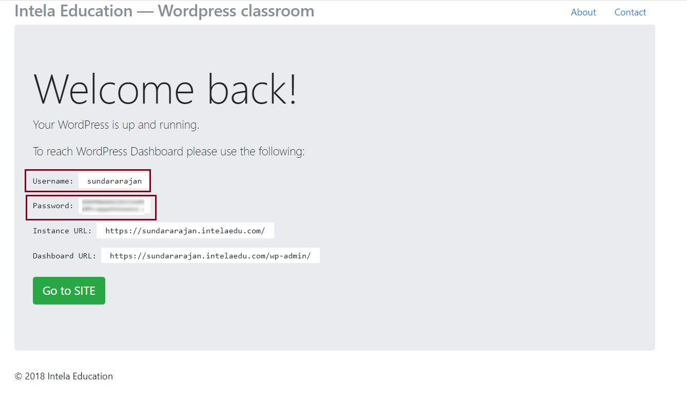
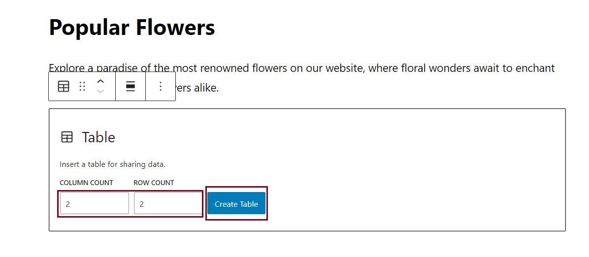

# Hands-on Lab: Enhance Mini Website using WordPress

<!--

-->

**Estimated time needed:** 40 minutes

## Objectives:
After completing this lab, you will be able to:

- Improve the existing WordPress installation by refining its elements
- Create an additional pair of pages and define and personalize the components on these pages
- Revise the menu items and make adjustments to the content of the two newly added pages

A content management system (CMS) like WordPress is a robust platform that empowers users to effortlessly create, manage, and organize digital content for their websites. With its user-friendly interface, WordPress simplifies the process of publishing and updating content, making it an ideal choice for creating an efficient and dynamic online presence.

## Setup: Get to the WordPress Admin

Access the **Hands-on Lab: Launch a WordPress site** by clicking the [Launch a WordPress site](https://www.coursera.org/learn/getting-started-with-front-end-and-web-development/ungradedLti/7IObz/generate-a-wordpress-site "link").

1. The tool in the **Hands-on Lab: Launch a WordPress site** generates and launches a WordPress site for you in a new browser tab.

2. You will receive the details as shown in the provided screenshot, including the credentials of your own WordPress website, which will direct you to -Intela Education- wordpress Classroom.
	1. It automatically generates a username and password for the **Intela Education- WordPress Classroom**.
	2. Based on these credentials, you can access the  **Instance URL** and **Dashboard URL** for navigating to the **Intela Education- WordPress Classroom** environment.

3. WordPress provides a user-friendly interface that enables users to manage content, customize the website\'s design and functionality, and control user access and permissions.

4. The Admin area allows users to create and edit pages, posts, and other types of content, manage media files, install and activate plugins and themes, and monitor website analytics.

5. In WordPress Admin, users can also manage user accounts, assign user roles and permissions, and moderate comments and user-generated content. The Admin area is only accessible to users with the appropriate login credentials and permissions.

## Exercise 1: Create a new page and add menu item

In this exercise, you will learn how to add a new page named `Popular Flowers` to your WordPress website and integrate it into the existing navigation bar, which is a common task that can help you expand your site\'s content and improve the user experience.

The page will list 2 of the most popular flowers sold on the website.
You will display the flowers in two columns, each showcasing a flower picture, description, care instructions, and gifting occasions.

Step-by-step instructions guide you through the process.

#### 1. Create a new page</b>

- Access the WordPress dashboard and locate the `Pages` tab on the left menu.

- Click `Add New` to create a new page.

- Provide an appropriate title and description for your page.

#### 2. Save and Publish your work

- After adding the content to your new page, click `Save Draft` to preserve your ongoing work. 

- When you are satisfied with the page's content, click on the `Publish` button, to make it accessible on your website.

#### 3. Modify the Menu.

- Navigate back to your WordPress dashboard.

- Click on `Appearance` in the Menu items. Further select `Menu`.

- Select the `Popular Flowers` menu, and click on `Add Menu`.

- Click on `Save Menu`.

- With this, the `Popular Flowers` page will be added to the Menu list, as shown below:

#### 4. Verify the updates:

- Return to your WordPress site to verify the changes. You will observe that the navigation bar now includes Popular Flowers.

 

## Exercise 2: Set up Popular Flowers page to edit

In this exercise, you will personalize the page settings to incorporate flower images utilizing a table format.

1. Navigate to your dashboard and select `All Pages` from the left side menu.

2. Hover over the `Popular Flowers` page, and click on the **Edit** option.

- With this, you will enter the **Popular Flower** page to customize it.

3. Click on the `Toggle Block Inserter` button on the top-left.

4. Select the `Table` option.

5. This will generate a template that allows you to select 2 columns and 2 rows.

6. Subsequently, click **Create table**, to generate a table.

3. The generated structure will look similar to:

With this, you have successfully personalized the page attributes.

 

## Exercise 3: Populate Popular Flowers page using images and text

1. Select the first cell.

2. Click on `More` and select the `Inline cell` option.

3. Select the image of the flower shown below and further click on `Select`.

4. With this, the flower's image will be added to the block.

5. You can align the image either to the left, right, or the centre.

6. Add descriptions of the flowers, care instructions, and ideal gifting occasions.

To customize the text layout, you can adjust the text color and other attributes. 

7. To achieve this, select the entire text and press **Tab** on your keyboard.

8. Click on the `Open document settings` button which opens to the bottom right.

9. This action opens a sidebar on the right side, where you can select the `Style` panel which will provide you options for making the desired changes.

 

## Exercise 4: Populate cells with flowers and text

1. You can similarly populate the 2nd cell with the detailed descriptions of the flowers, care instructions, and ideal gifting occasions, accompanied by captivating images.

2. Click on the `Update` button on the top right to publish your updated content.

3. Following this, click on this button to reopen the application to access the application.

4. Verify the `Popular Flowers` page to see if all the syling aspects have been successfully implemented, and whether it meets your satisfaction.

 

### Congratulations! You have completed the lab on Enhancing Mini Website using WordPress.

## Summary:

In this lab, you created your WordPress installation, crafted personalized pages, and enhanced your website\'s content and navigation. Your website is now efficient and user-friendly.

<footer>

</footer>

## <h3 align="center"> &#169; IBM Corporation. All rights reserved. <h3/>

<!---
## Author(s)
Ramanujam
Richa Arora

### Other Contributor(s)
Rav Ahuja

## Changelog
| Date | Version | Changed by | Change Description |
|------|--------|--------|---------|
| 2023-08-21 | 0.1 | Richa Arora | Initial version created |
| 2023-09-06 | 0.2 | Steve Hord | QA pass with edits |
| 2023-12-01 | 0.3 | K Sundararajan | Instructions updated as per the latest process in the IntelaEdu WordPress UI |

## <h3 align="center"> &#169; IBM Corporation 2023. All rights reserved. <h3/>
--->
