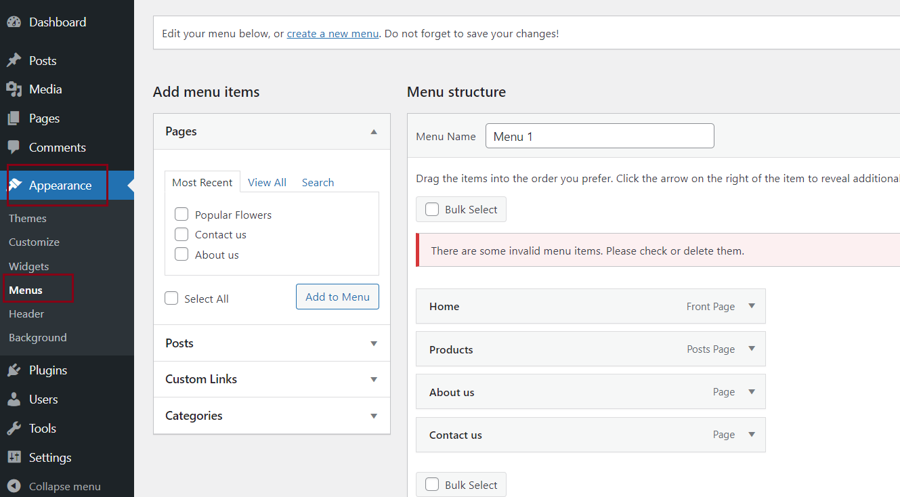
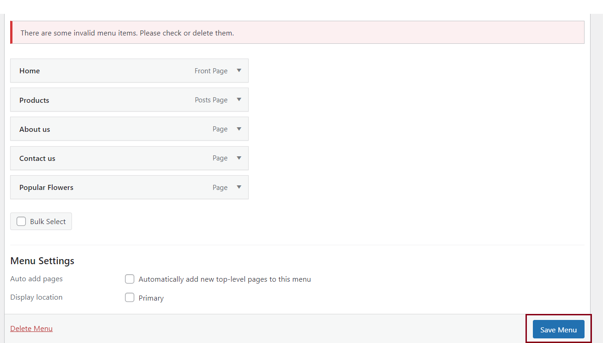
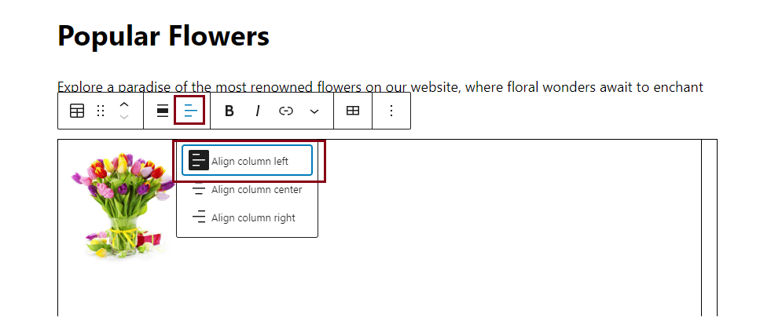

# Hands-on Lab: Enhance Mini Website using WordPress

<!--

-->

**Estimated time needed:** 40 minutes

## Objectives:
After completing this lab, you will be able to:

- Improve the existing WordPress installation by refining its elements
- Create an additional pair of pages and define and personalize the components on these pages
- Revise the menu items and make adjustments to the content of the two newly added pages

A content management system (CMS) like WordPress is a robust platform that empowers users to effortlessly create, manage, and organize digital content for their websites. With its user-friendly interface, WordPress simplifies the process of publishing and updating content, making it an ideal choice for creating an efficient and dynamic online presence.

## Setup: Get to the WordPress Admin

Access the **Hands-on Lab: Launch a WordPress site** by clicking the [Launch a WordPress site](https://www.coursera.org/learn/getting-started-with-front-end-and-web-development/ungradedLti/7IObz/generate-a-wordpress-site "link").

1. The tool in the **Hands-on Lab: Launch a WordPress site** generates and launches a WordPress site for you in a new browser tab.

2. You will receive the details as shown in the provided screenshot, including the credentials of your own WordPress website, which will direct you to -Intela Education- wordpress Classroom.
	1. It automatically generates a username and password for the **Intela Education- WordPress Classroom**.
	2. Based on these credentials, you can access the  **Instance URL** and **Dashboard URL** for navigating to the **Intela Education- WordPress Classroom** environment.

3. WordPress provides a user-friendly interface that enables users to manage content, customize the website\'s design and functionality, and control user access and permissions.

4. The Admin area allows users to create and edit pages, posts, and other types of content, manage media files, install and activate plugins and themes, and monitor website analytics.

5. In WordPress Admin, users can also manage user accounts, assign user roles and permissions, and moderate comments and user-generated content. The Admin area is only accessible to users with the appropriate login credentials and permissions.

## Exercise 1: Create a new page and add menu item

In this exercise, you will learn how to add a new page named `Popular Flowers` to your WordPress website and integrate it into the existing navigation bar, which is a common task that can help you expand your site\'s content and improve the user experience.

The page will list 2 of the most popular flowers sold on the website.
You will display the flowers in two columns, each showcasing a flower picture, description, care instructions, and gifting occasions.

Step-by-step instructions guide you through the process.

##### 1. Create a new page

1. Access the WordPress dashboard and locate the `Pages` tab on the left menu.

2. Click **Add New** to create a new page.

Provide an appropriate title for your page, marked as number 1.
Input the desired content for display on this new page, noted as number 2.
After adding the content to your new page, ensure you click **Save Draft** to preserve your ongoing work. 
When you are satisfied with the page's content, proceed to click the **Publish** button, depicted as number 3, to make it accessible on your website.

3. Modify the Menu.
- Navigate back to your WordPress dashboard. Click **Appearance**, indicated as number 1 in the menu items. Then, as referenced by number 2, select **Menu** and pick out Popular Flowers as shown at number 3. Following this step, proceed to click on Add Menu as indicated by number 4.

Then the Popular Flowers page will be added in the menu list as shown below.

4. Return to your WordPress site to verify the changes. You will observe that the navigation bar now includes Popular Flowers.

5. 

## Exercise 2: Set up Popular Flowers page to edit

During this activity, you will personalize the page settings to incorporate flower images utilizing a table format.

1. Navigate to your dashboard and select **All Pages** from the left side menu. Select the Popular Flowers page you want to modify and then click the **Edit** option.

After this, you will enter the **Popular Flower** page to customize it.

2. While editing the new page, you will encounter a segment located on the left side named **Toggle Block Inserter**. Click this section to choose the **table** option, identified as number 1 in the block menu item. This action will generate a template that allows you to select 2 columns and three rows, denoted as number 2. Subsequently, click **create table**, indicated as number 3, to complete the process.

3. After personalizing the page attributes, you will generate a structure similar to the one depicted below.

4. adaf

5. adafags

## Exercise 3: Populate Popular Flowers page using images and text

1. Next, select the cell located in the top-left corner (identified as number 1 in the accompanying screenshot). Following this, access the \'Toggle Block Inserter\' function. Choose the \'image\' option, indicated as number 2, and then click on the media library labeled as number 3 in the screenshot. From here, you can either select an image that is already present or upload a new image if desired.

2. You should include detailed descriptions of the flowers, care instructions, and ideal gifting occasions, accompanied by captivating images.

3. Then, follow the provided screenshot sequence to add an image, add related text and click **alignment**.

4. You can align the entire cell in left, right or center position.

5. To customize the text layout, you have the option to adjust the text color and other attributes. Simply select the entire text and press **Tab** on your keyboard. This action opens a sidebar on the right side, allowing you to make the desired changes.

6. adaf

7. dgagsdg

## Exercise 4: Populate cells with flowers and text

1. You need to populate all the remaining cells with the detailed descriptions of the flowers, care instructions, and ideal gifting occasions, accompanied by captivating images.

2. Following this, reopen the application to access the Popular Flowers page. Verify if the alignment meets your satisfaction and if you have successfully implemented all the changes.

3. fsfsgdsg

### Congratulations! You have completed the lab for Enhancing Mini Website using WordPress.

## Summary:

In this lab, you improved your WordPress installation, crafted personalized pages, and enhanced your website\'s content and navigation. Your website is now more efficient and user-friendly.

<footer>

</footer>

## <h3 align="center"> &#169; IBM Corporation. All rights reserved. <h3/>

<!---
## Author(s)
Ramanujam
Richa Arora

### Other Contributor(s)
Rav Ahuja

## Changelog
| Date | Version | Changed by | Change Description |
|------|--------|--------|---------|
| 2023-08-21 | 0.1 | Richa Arora | Initial version created |
| 2023-09-06 | 0.2 | Steve Hord | QA pass with edits |
| 2023-12-01 | 0.3 | K Sundararajan | Instructions updated for proceeding correctly as per the updated WordPress UI |

## <h3 align="center"> &#169; IBM Corporation 2023. All rights reserved. <h3/>
--->
